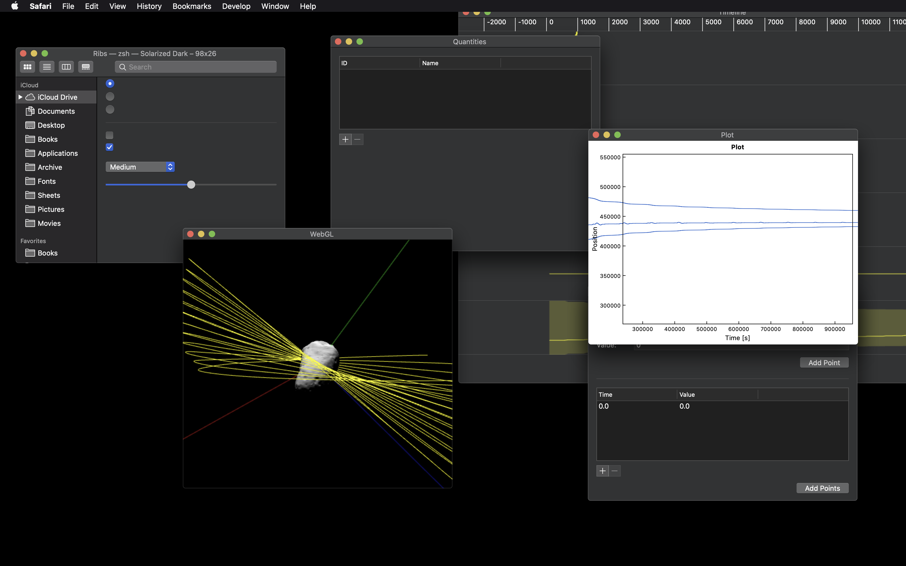

# Ribs

A simple, fast reactive web framework that enhances native DOM APIs instead of trying to supplant them.

The core idea in Ribs is to make it easy to configure imperative DOM APIs to react automatically and granularly to changes in mutable data. This ends up looking very different from a model like React, where entire branches of a UI are re-generated in response to small changes. It is more performant than React, without sacrificing ease of use. (Well, so I think. I am obviously biased.)

**Figure 1.** A web UI for visualizing orbit simulation data, created using Ribs to mimic the appearance and behavior of a MacOS desktop environment.

## License

This software is [unlicensed](LICENSE). You may not use, redistribute, or create derivative works from this software without my permission.
